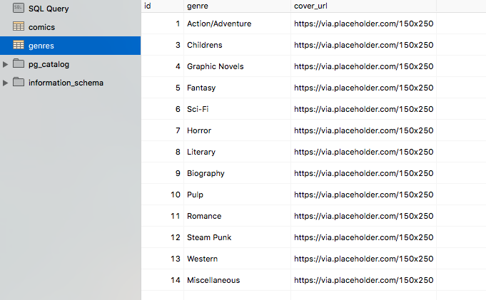

# MyComicBook-App
An M.E.A.N. app for managing my comic book collection.

## Technology

1. Node.js
2. Angular.js
3. AngularMaterials
4. Express
5. Heroku
6. PostgreSQL

## Project Outline

This app is part of a 5 day challenge to create a **full-stack** javascript application.

### Basic features:

- [x] Add new comic books with properties:
	- [x] Title
	- [x] Author
	- [x] Artist
		- Cover
		- Interior
	- [x] Absolute Image URL
	- [x] Publisher
	- [x] Date Published
	- [x] Genre
	- [x] Page Count
	- [x] Favorite
	- [x] Read
- [x] Remove comic books
- [x] Add new Genres
	- [x] Show number of entries in genre
- [x] Remove Genres

### Stretch Goals:

- [x] Bootstrap for design
- [ ] Edit genres and comics
- [ ] Ability to search or filter by name or genre
- [ ] Vote up or down an entry
- [ ] Abilty to add favorites and display on a separate route

## Setup
Setup code can also be found in setup.sql
```sql
-- Initializes the 'genres' table
CREATE TABLE genres (
	id SERIAL PRIMARY KEY,
	genre varchar(50) not null,
	cover_url varchar(255) DEFAULT 'https://via.placeholder.com/100x100'
);

--Initializes Comic table, which will hold basic data about each comic.
-- Depends on the 'genres' table
CREATE TABLE comics (
	id SERIAL PRIMARY KEY,
	title varchar(255) DEFAULT null,
	issue int DEFAULT null,
	written_by varchar(100) DEFAULT null,
	art_by varchar(100) DEFAULT null,
	cover_by varchar(100) DEFAULT null,
	comic_genre int REFERENCES "genres" DEFAULT 14,
	publisher varchar(50) DEFAULT null,
	release_date DATE DEFAULT null,
	page_count int DEFAULT null,
	image_url varchar(255) DEFAULT 'https://via.placeholder.com/150x250',
	did_read boolean DEFAULT FALSE,
	favorite boolean DEFAULT FALSE
);


-- Adds starting data for "genres"
INSERT INTO "genres" ("genre", "cover_url")
VALUES
('Action/Adventure', 'https://via.placeholder.com/100x100'),
('Childrens', 'https://via.placeholder.com/100x100'),
('Graphic Novels', 'https://via.placeholder.com/100x100'),
('Fantasy', 'https://via.placeholder.com/100x100'),
('Sci-Fi', 'https://via.placeholder.com/100x100'),
('Horror', 'https://via.placeholder.com/100x100'),
('Literary', 'https://via.placeholder.com/100x100'),
('Biography', 'https://via.placeholder.com/100x100'),
('Pulp', 'https://via.placeholder.com/100x100'),
('Romance', 'https://via.placeholder.com/100x100'),
('Steam Punk', 'https://via.placeholder.com/100x100'),
('Western', 'https://via.placeholder.com/100x100'),
('Miscellaneous', 'https://via.placeholder.com/100x100'),
('NA', 'https://via.placeholder.com/100x100');

-- Sample Data for "comics"
INSERT INTO "comics" ("title", "issue", "written_by", "art_by", "cover_by", "comic_genre", "publisher", "release_date", "page_count", "image_url", "did_read", "favorite")
VALUES
('The Infinity Gauntlet', null, 'Jim Starlin', 'George Perez', 'George Perez', '1', 'Marvel', 'July 10, 1991', '256', 'https://via.placeholder.com/150x250', TRUE, TRUE),
('Watchmen', null, 'Alan Moore', 'Dave Gibbons', 'Dave Gibbons', '4', 'DC Comics', 'April 1, 1995', '416', 'https://via.placeholder.com/150x250', TRUE, FALSE),
('Parasyte', '1', 'Hitoshi Iwaaki', 'Hitoshi Iwaaki', 'Hitoshi Iwaaki', '1', 'Kodansha Comics', 'July 26, 2011', '288', 'https://via.placeholder.com/150x250', FALSE, TRUE),
('Parasyte', '2', 'Hitoshi Iwaaki', 'Hitoshi Iwaaki', 'Hitoshi Iwaaki', '1', 'Kodansha Comics', 'July 26, 2011', '288', 'https://via.placeholder.com/150x250', TRUE, TRUE),
('Batman: The Long Halloween', null, 'Jeph Loeb', 'Tim Sale', 'Tim Sale', '1', 'DC Comics', 'October 11, 2011', '384', 'https://via.placeholder.com/150x250', FALSE, FALSE),
('Lose', '5', 'Michael Deforge', 'Michael Deforge', 'Michael Deforge', '13', 'Koyama Press', null, null, 'https://via.placeholder.com/150x250', TRUE, TRUE),
('Azrael: Death''s Knight', null, 'Fabian Nicieza', 'Frazer Irving, J. Calafiore, Tom Mandrake, Mark Mckenna, Nathan Eyring, Sal Cipriano, John J. Hill', 'Guillem March, J. Calafiore', '1', 'DC Comics', 'August 3, 2010', '144', 'https://via.placeholder.com/150x250', TRUE, FALSE),
('The Uncanny X-MEN: The Dark Pheonix Saga', null, 'Chris Claremont, Jo Duffy', 'John Byrne, Terry Austin, Glynis Wein, Bob Sharen, Tom Orzechowski', 'John Byrne, Terry Austin, Thomas Mason, Andy Troy', '1', 'Marvel Comics', 'April 25, 2012', '200', 'https://via.placeholder.com/150x250', TRUE, TRUE),
('Death - The Time of Your Life', null, 'Neil Gaiman', 'Chris Bachalo, Mark Buckingham, Mark Pennington, Matt Hollingsworth, Todd Klein', 'Dave Mckean', '4', 'DC/Vertigo Comics', 'December 1, 1997', '96', 'https://via.placeholder.com/150x250', FALSE, FALSE);
```

## Screenshots
#### Interface
#### Genres Table


## Next Steps
- [x] Add favorites functionality
- [x] Ability to indicate books that have been read
- [x] Clean up UI design


## Author
Twitter - @JakehClark <br>
Github - @Maelstrm <br>
LinkedIn - Jakeh Clark